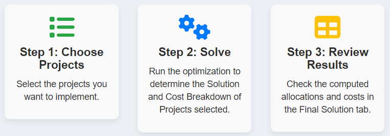
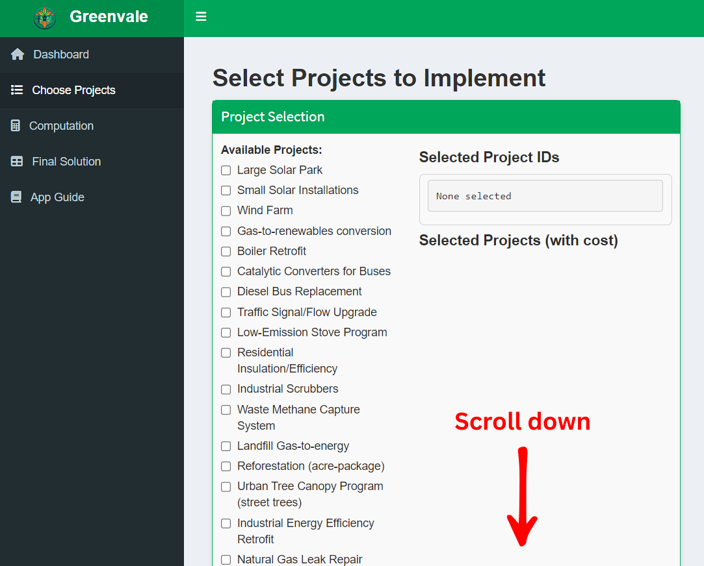
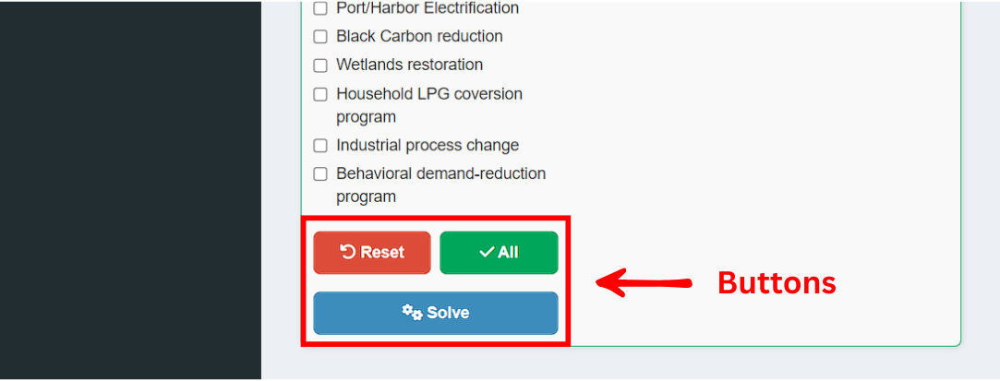
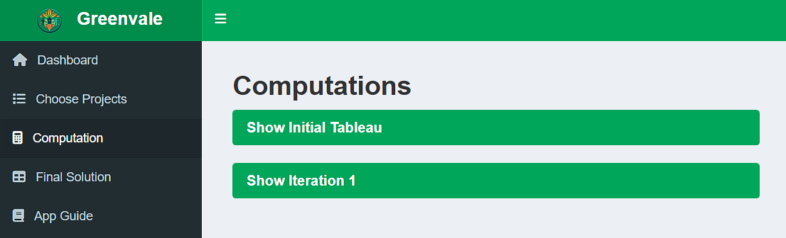
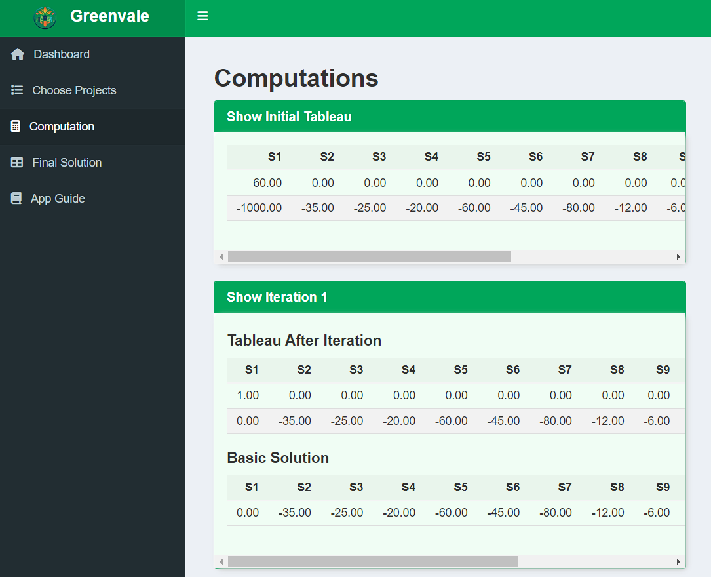
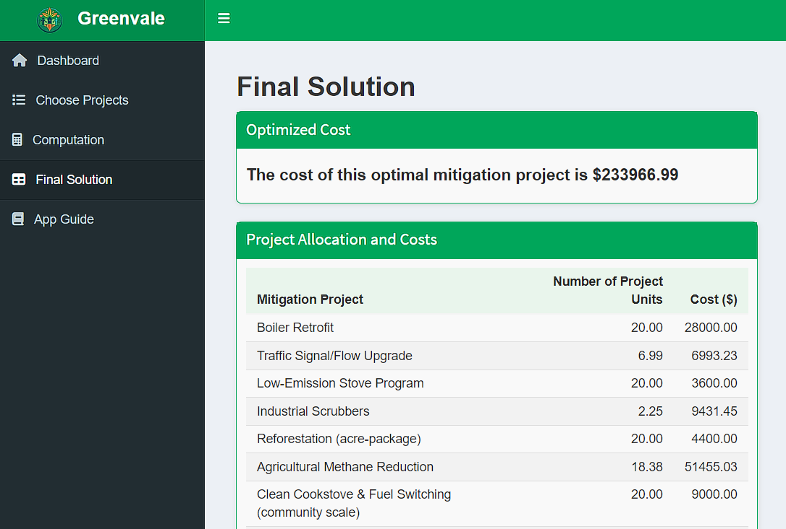
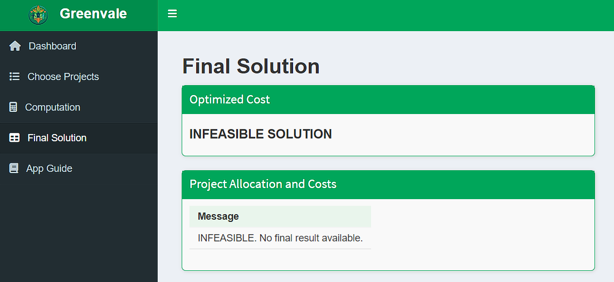

<div align="center">
  

# Greenvale Pollution Reduction Planner


</div>

An interactive **R Shiny dashboard** and **optimization solver** designed to minimize environmental mitigation costs while satisfying strict city-wide pollutant reduction targets through Linear Programming.

**📄 User Manual:** [UserManual.pdf](UserManual.pdf)

---

## 📖 Table of Contents

- [About the Project](#about-the-project)
- [Mathematical Model](#mathematical-model)
- [Built With](#built-with)
- [Project Structure](#project-structure)
- [System Architecture](#system-architecture)
- [Features](#features)
- [Visuals & Demo](#visuals--demo)
- [Installation](#installation)
- [Usage](#usage)
- [Technical Highlights](#technical-highlights)
- [Contributing](#contributing)
- [Contact](#contact)

---

## About the Project

This project is a mathematical optimization tool developed for the **City Pollution Reduction Plan**.

The fictional **City of Greenvale** has been mandated to significantly reduce its environmental pollution within one year. To accomplish this objective, the city must satisfy minimum reduction targets for **ten priority pollutants**, including **CO₂, NOx, SO₂, PM2.5, and Methane**.

To achieve these targets, city planners may implement any combination of **30 available mitigation projects**, each having its own implementation cost and pollutant reduction effectiveness. Because resources are limited, selecting the optimal combination of projects becomes a **Linear Programming minimization problem**.

This application implements a **custom Simplex Minimization algorithm** built entirely in R to determine the least-cost combination of mitigation projects while ensuring that every pollution reduction target is satisfied.

---

## Mathematical Model

The optimization problem is formulated as a **Linear Programming Minimization Problem**.

### Objective Function

Minimize:
$$Z=\sum_{i=1}^{30}c_ix_i$$

where:
- $x_i$ is the number of units of mitigation project *i*
- $c_i$ is the implementation cost of project *i*

### Subject to Constraints

Each pollutant reduction target must be satisfied:
- CO₂ reduction
- NOx reduction
- SO₂ reduction
- PM2.5 reduction
- Methane reduction
- ...and the remaining pollutants

along with:
$$x_i\ge0$$

for every mitigation project. The Simplex Minimization algorithm computes the lowest-cost feasible solution satisfying all constraints.

---

## Built With

- R Programming Language
- R Shiny
- shinydashboard
- Bootstrap
- HTML & CSS
- CSV Data Storage

---

## Project Structure

```text
pollution-reduction-solver/
├── www/                            # Images and UI assets
│   ├── dashboard_steps.png
│   ├── expanded_computation.png
│   ├── feasible_solution.png
│   ├── infeasible_solution.png
│   ├── logo.png
│   ├── select_projects.png
│   ├── select_projects_btn.png
│   └── unexpanded_computation.png
├── .gitignore                      # Git ignore rules
├── app.R                           # Main Shiny application
├── projects.csv                    # Mitigation project dataset
├── simplex_minimization.R           # Simplex minimization algorithm
├── targets.csv                     # Pollution reduction targets
├── UserManual.pdf                  # User guide
└── README.md                       # Project documentation
```

---

## System Architecture

```text
projects.csv
              \
               \
                --> simplex_minimization.R --> app.R --> Shiny Dashboard
               /
targets.csv   /
```

---

## Features

- 🧮 **Custom Simplex Algorithm** – Implements a Simplex Minimization algorithm from scratch to determine the least-cost solution for the Linear Programming model.

- 📊 **Dynamic Computations** – Displays every Simplex iteration, including the normalized tableau and basic solution, allowing users to inspect every mathematical step.

- ⚙️ **Interactive Project Selection** – Enables users to select any subset of the available mitigation projects, with convenient **Select All** and **Reset** controls.

- 💰 **Detailed Cost Breakdown** – Produces a complete optimization report showing the selected mitigation projects, required implementation units, individual costs, and total minimum cost.

- 🚦 **Feasibility Detection** – Automatically determines whether the selected project combination is capable of satisfying all pollution reduction constraints.

---

## Visuals & Demo

### 1. Dashboard Overview

The landing page provides a guided overview of the optimization workflow, allowing users to understand the complete solving process before running the algorithm.

> **Screenshot:** Main dashboard introducing the four-step optimization workflow.



---

### 2. Selecting Mitigation Projects

Users may freely choose which mitigation projects should be considered during optimization.

The interface also provides **Select All** and **Reset** buttons for efficiently managing large project selections.

> **Screenshot:** Selecting mitigation projects before solving.



> **Screenshot:** Bulk selection controls.



---

### 3. Simplex Computations (Step-by-Step)

For complete algorithm transparency, every iteration of the Simplex method is displayed using expandable computation panels.

Users can inspect the normalized tableau and basic solution produced at each pivot operation.

> **Screenshot:** Collapsed computation panels.



> **Screenshot:** Expanded Simplex iteration showing the tableau and basic solution.



---

### 4. Final Optimized Solution

After completing the optimization, the application determines whether the chosen project combination is feasible and displays the optimal allocation together with the minimum implementation cost.

> **Screenshot:** Feasible optimization result.



> **Screenshot:** Infeasible project selection.



---

## Installation

### Prerequisites

- R
- RStudio Desktop

1. **Clone the repository**

   ```bash
   git clone https://github.com/vinvin-prog/pollution-reduction-solver.git
   ```

2. **Set the working directory**

   Open **RStudio**, then run the following command in the Console, replacing `<path-to-project-folder>` with the exact location of the cloned repository.

   ```R
   setwd("<path-to-project-folder>")
   ```

3. **Install the required packages**

   Run the following commands inside the RStudio Console to install the required dependencies.

   ```R
   install.packages("shiny")
   install.packages("shinydashboard")
   ```

4. **Run the application**

   You can launch the application using either **RStudio** or **Visual Studio Code (VS Code)**.

   **Option A: Using RStudio (Recommended)**

   Open **app.R** and click the green **Run App** button in the upper-right corner of the RStudio editor.

   **Option B: Using VS Code (Interactive R Terminal)**

   1. Open the project folder in **VS Code**.
   2. Open a new terminal (`Ctrl` + `` ` ``).
   3. Type the following command and press **Enter** to start the interactive R console.

      ```bash
      R
      ```

      Your terminal prompt should change to `>`.

   4. Run the following command to launch the application.

      ```R
      shiny::runApp()
      ```

      The terminal will display a local URL similar to:

      ```text
      Listening on http://127.0.0.1:xxxx
      ```

      Hold **Ctrl** and click the URL to open the application in your web browser.

      To stop the application and shut down the local server, return to the terminal and press **Ctrl + C**.

   **Option C: Using VS Code (PowerShell Direct Path Fallback)**

   Use this method if Option B produces an **`R is not recognized`** or **`Command Not Found`** error.

   1. Locate your R installation (typically `C:\Program Files\R\R-4.x.x\bin\Rscript.exe`).
   2. Open a new terminal in **VS Code**.
   3. Replace the example path below with the version installed on your computer, then run:

      ```powershell
      & "C:\Program Files\R\R-4.3.1\bin\Rscript.exe" -e "shiny::runApp()"
      ```

> **Note:** Replace `R-4.3.1` with the version of R installed on your computer.

> **Note:** The application requires the `app.R`, `projects.csv`, `targets.csv`, and `simplex_minimization.R` files to remain in the project directory. Ensure these files are not moved or renamed before launching the application.

---

## Usage

After launching the application, navigate through the dashboard using the sidebar.

- **Dashboard** – View the project overview and workflow.
- **Choose Projects** – Select mitigation projects to include in the optimization model. Use the **Select All** or **Reset** buttons for convenience before clicking **Solve**.
- **Computation** – Review each Simplex iteration, including the tableau and basic solution.
- **Final Solution** – View whether the optimization problem is feasible, the minimum implementation cost, and the recommended project allocation.
- **App Navigation** – Access the built-in user guide for additional instructions.

---

## Technical Highlights

- **Custom Linear Programming Solver** – Developed a Simplex Minimization implementation entirely in R without relying on external optimization packages.
- **Dynamic Tableau Generation** – Automatically constructs and updates the Simplex tableau throughout every pivot iteration.
- **Transparent Computation** – Every iteration, normalized tableau, and basic solution is displayed to help users understand the optimization process visually.
- **Reactive Dashboard** – Utilized Shiny's reactive programming model to dynamically update computations and outputs based on user selections.
- **Modular Data Design** – Pollution targets and mitigation projects are stored separately in CSV files, making the system easy to extend.
- **Responsive Interface** – Built using Bootstrap components and custom HTML/CSS for a clean user experience.

---

## Contributing

Contributions are welcome! If you have suggestions for improving the project, feel free to:

1. Fork the repository.

2. Create a feature branch.

    ```bash
    git checkout -b feature/OptimizationUpdate
    ```

3. Commit your changes.

    ```bash
    git commit -m "Add some OptimizationUpdate"
    ```

4. Push the branch.

    ```bash
    git push origin feature/OptimizationUpdate
    ```

5. Open a Pull Request.

---

## Contact

**Amiel Vincent De Castro**

- **GitHub:** [vinvin-prog](https://github.com/vinvin-prog)
- **Email:** avdc02@gmail.com

**Project Repository:** [Pollution Reduction Solver](https://github.com/vinvin-prog/pollution-reduction-solver)
